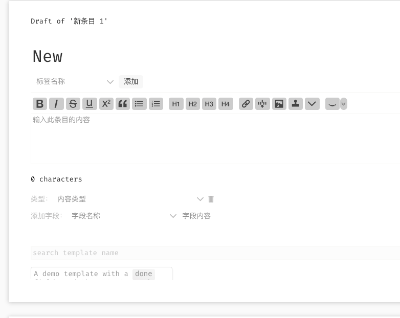
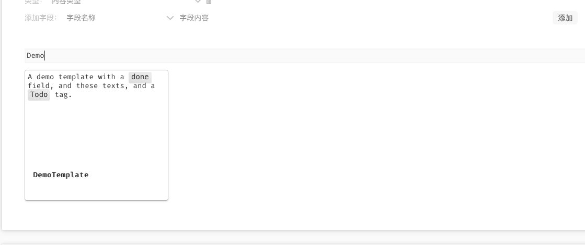

# Wikitext plugin template for TiddlyWiki5

[中文](src/Readme-zh_CN.tid)

## !! Features

This plugin provides [[[FeiShu Doc](https://www.feishu.cn/hc/zh-CN/articles/222318959624)|https://www.feishu.cn/hc/zh-CN/articles/222318959624]] style template list for newly created tiddler.

Try create a new tiddler on [demo page](tiddly-gittly.github.io/template-list/).

## !! Add new template

`$:/tags/TextEditor/Template` is the tag for the templates. Add this tag to a tiddler, and that tiddler will show up in the template list.

## !! Apply the template

After you create an empty tiddler, that have an empty text field. You will notice that a template and a search bar show up in the bottom of the tiddler.

Click on a template will apply all tags and all fields to the currentTiddler.

You can scroll to reveal more template if you have more than two rows of templates.

